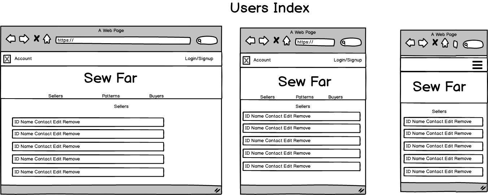
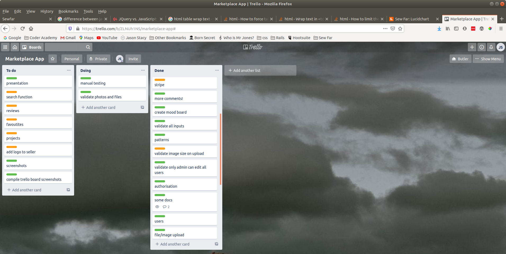

# Marketplace App - Sew Far

## Identification of the problem you are trying to solve by building this particular marketplace app.

Knitting has [Ravelry](https://www.ravelry.com/). A place to go where anyone can upload and sell a knitting pattern, but sewers have been left to buy their patterns from major companies. There are sites like [Etsy](https://www.etsy.com/) that allow people to post their designs but nothing that's dedicated to sewing. This has left a gap in the market for a more community based sharing solution for sewers. Sew Far fills this gap. This is one way people can reach out and find people with similar interests. Sewers don't currently have a dedicated site where they can go and share their designs, show off their sewing skills and be a part of the sewing community. 

## Why is it a problem that needs solving?

In today's world where Coronavirus has forced us into a new way of living, many people have taken up sewing while spending more time at home. This is because people not only have more time on their hands when they are not working but have fewer opportunities to shop for clothes when isolating. Sew Far is a site where people can not only look for sewing patterns that other people have created, they can even create their own patterns and share them with the world. We are all trying to be more connected in a world that is socially distanced. Online connection is becoming more and more important. When you can share your interests with similar minded people, it creates a community that supports and understands one another in a more meaningful way. 

## A link (URL) to your deployed app (i.e. website)

https://rocky-taiga-59064.herokuapp.com/

## A link to your GitHub repository (repo).

https://github.com/drumovski/sewfar

## Description of your marketplace app (website), including:

#### Purpose:

I believe there is a gap in the market for people who enjoy making their own clothes at home using their sewing skills. Especially with the rise of Coronavirus and people forced to stay at home. To make a garment with a sewing machine, you need a pattern. Patterns have typically been available from major companies but not from everyday people who want to share designs they have made.

Sew Far is a web app that allows sewers to come together and buy and sell their patterns. It will build a community and allow people who are passionate about sewing to come together and share their love of creating their own clothes.

I'm doing this as a suggestion from my wife who loves to sew. She complained that there wasn't a good sewing site where people could come together and share designs. Knitting has Ravelry, and there are some sewing designs on Pintrest but there isn't a good sewing specific site that caters for the seamstresses out there with a knack of a creating a good outfit. So I'm creating one.

#### Functionality / features

The site will be focused around the patterns people create. Anyone can enter their business details, become a seller and start uploading patterns. Users will be able to purchase these patterns and download instructions on how to make them. Patterns will have photos and details about the sewing patterns like a description, sizes the pattern is for, difficulty, and who the pattern is designed for (women, men, toys etc). 

#### Sitemap

#### Screenshots

Log in page

Patterns page

Patterns page showing sellers patterns and all patterns

Edit user details

Edit seller details

Admin access page

New seller

New signup

Top of pattern show

Bottom of pattern show

Seller details

#### Target audience

The target audience is primarily sewers and seamstresses. I try not to generalise but lets be honest, most will be women. They will range in sewing skills from beginners to advanced. Obviously, the users who are creators of patterns will be at a higher skill level and may have some professional training.

#### Tech stack (e.g. html, css, deployment platform, etc)

Ruby on Rails

HTML

SCSS

Heroku

Stripe

Javascript (bootstrap)

Jquery (bootstrap)

## User stories for your app

##### As someone who is not a user:

​	I want to be able to sign up

​	I should only be able to upload jpgs or png files for my avatar

​	I want to be able to see all the patterns

​	I want to be able to see the details of one pattern

​	I want to be able to see the details of the pattern creator

​	I should not be able to purchase any patterns

​	I should not be able to edit any user or seller details

​	I should not be able to create any patterns

##### As a user:

​	I want to log in using my email and password

​	I want to be able to log out of my account

​	I want to be able to cancel my account

​	I want to edit my account details

​	I want the option to become a seller

​	I want to be able to see all the patterns

​	I want to be able to see the details of one pattern

​	I want to be able to see the details of the pattern creator

​	I want to be able to purchase a pattern and see it in my purchased patterns.

​	I want to download a pattern PDF from a pattern I have purchased

​	I should not be able to edit patterns 

​	I should not be able to see or remove other users

​	I should not be able to edit any user or seller details

​	I should not be able to create any patterns

##### As a seller:

​	I want to log in using my email and password

​	I want to be able to log out of my account

​	I want to be able to cancel my user account and remove my seller account automatically

​	I want to edit my user account details

​	I want to edit my seller details

​	I want to cancel my seller account without affecting my user account

​	If I cancel my user or seller account, I want all patterns I created to be free of charge

​	I want to be able to see all the patterns

​	I want to be able to see the details of one pattern

​	I want to be able to see the details of the pattern creator

​	I want to be able to purchase a pattern and see it in my purchased patterns.

​	I want to download a pattern PDF from a pattern I have purchased

​	I want to be able to make a new pattern

​	I should only be able to upload jpgs for my pattern images

​	I should only be able to upload a pdf for downloadable instructions

​	I want to be able to edit patterns I have created

​	I want to be able to delete patterns I have created only if they have not been purchased

​	I want to see all the patterns I have created

​	I should not be able to see or remove other users

​	I should not be able to edit any user or seller details

##### As an admin:

​	I want to log in using my email and password

​	I want to be able to log out of my account

​	I want to edit my user account details

​	I want to be able to see all the patterns

​	I want to be able to see the details of one pattern

​	I want to be able to see the details of the pattern creator

​	I want to be able to purchase a pattern and see it in my purchased patterns.

​	I want to download a pattern PDF from a pattern I have purchased

​	I want to be able to edit all patterns.

​	I want to be able to delete any patterns only if they have not been purchased

​	I want to be able to see a list of all the buyers and sellers 

​	I want to be able to edit / remove sellers

​	I want to be able to remove users

## Wireframes for your app

Colours:

beebe9 (aqua), 

fffdf9 (white), 

ffe3ed (pink), 

8ac6d1(blue)

Mood Board:

## An ERD for your app

Tables in orange are 'nice to have's'

They have not been included in the final app at this stage.

## Explain the different high-level components (abstractions) in your app

Asterisks indicate the component has yet to be implemented.

Buyers - Buyers will be people interested in a new sewing project. They may already have a garment in mind or they may be looking for something more general they can do. They will look through the patterns and be able to choose one to do.

Sellers - Sellers are people who create patterns to share and sell. They upload their designs (patterns) with instructions, pictures and information on what is required.

Users - these ended up being buyers and sellers combined into one. This made more sense as it allowed sellers to purchase other patterns as well as creating their own. For a user to become a seller, they just need to enter their business information. 

Patterns  - These are the 'listings.' They tie everything together and are the reason people visit the site. Patterns contain all the information on how to make a sewing pattern with instructions, pictures and a downloadable file that can be printed to make a template for the sewing design. Patterns can be categorised in several ways. They have a garment type (scarf, blouse, skirt, etc) a use type (male, female, unisex, toy) and can also be grouped by their difficulty (easy, medium, or hard). In addition, the patterns will be able to be sorted by who created them and who has purchased them.

*Projects - These are actual creations uploaded by buyers from patterns they have purchased with photos attached. They are linked to the patterns so users can view the creations buyers have made from a particular pattern. They will be useful to other buyers when deciding to purchase a pattern as they will be able to see how successful others have been when using the pattern. They will also be a way for buyers to show off and share their creations.

*Reviews - These will be comments and ratings given to patterns to allow users to more discerning when purchasing patterns.

*Favourite Patterns - This is simply a tag given to a pattern if the user wishes to 'save' the pattern without purchasing it. They can then easily find the pattern in their 'favourites' list easily without having to search for it again.

*Searching - Users will have the ability to search for different patterns through a variety of fields such as garment, use type (male female), difficulty, review, price and size.

## Detail any third party services that your app will use

#### Devise gem:

I will use devise to handle all authentication. I will customise it into my users table to integrate it into sew far as opposed to being something more 'tacked on.' I will implement a soft delete functionality, overriding the default destroy. This is due to the users table being intrinsically linked to the patterns table. If other users have purchased patterns, I do not want those patterns to be removed if the creator of the patterns were to be destroyed. Instead, I will include logic to make all the patterns of the user being deleted free of charge.

#### Bootstrap gem (including jquery)

Bootstrap will be used to quickly get some basic styling. I will mainly  use it for the nav bar.

#### Country select gem 

This will be used for the sellers table to input the country in the address.

#### AWS S3

I will implement file uploads in three areas. Firstly to allow users to have a photo avatar. Secondly, to allow sellers to upload multiple photos to their patterns and thirdly, to allow PDF instructions in the patterns to be uploaded by their creators and downloaded when users purchase them.

#### Image processing gem

This will be added to allow functionality for images to be resized and saved in AWS S3

#### Stripe

Stripe will allow users to purchase patterns and once confirmed via a webhook, I can create a list of their purchased patterns through transactions.

#### Ultrahook

For development purposes, Ultrahook will allow me to get confirmation that a payment has been made in the local development environment.

## Describe your projects models in terms of the relationships (active record associations) they have with each other

Models included: User, Pattern, Seller, Garment, Transaction.

#### Users have many patterns, one seller, many transactions and one attached picture. It is indexed on email.

​	Users relationship to patterns is through either being a seller (creating many patterns) or being a buyer (through purchasing patterns recorded in transactions). 

#### Patterns has many transactions, many attached pictures and one attached file. It belongs to user and garment

​	Patterns contains the user_id and garment_id references. The user_id reference is the user who created the pattern.

#### Seller belongs to user.

​	Seller contains the user_id reference of its 'parent'. It is intrinsically linked to the user and there is only ever one user to one seller. 

#### Garment has many patterns.

​	Garments are not indexed by anything other than their own id and are just referenced in patterns. Many patterns may have the same garment name

#### Transaction belongs to user and pattern.

​	Transactions are indexed by pattern_id and user_id. Every time a pattern is purchased, the transaction record is created with the pattern_id of the pattern purchased and the user_id of the buyer.

## Discuss the database relations to be implemented in your application

The two main tables are Patterns and Users. Originally, I had separated the users into separate buyers and sellers tables as they had vastly different information. I realised this was best represented by having all users the same but with a sellers table optionally attached if the user became a seller. This makes more sense and allows user/sellers to be buyers too. 

Users can create many patterns, but only if they also have a seller table attached. This makes them a seller. A user doesn't necessarily have a seller account attached in which case they are just considered a buyer. A user can be both a seller and buyer - that is they may create patterns as well as purchasing other peoples patterns. If a user is deleted, it would have been necessary to delete the patterns they had created or they would be left orphaned. This would be unfair on users who had previously purchased the patterns so instead I implemented a soft delete on the user and included logic to make the patterns free so the deleted user had no claim to further money. Users may or may not have a picture avatar attached. 

Sellers have a one to one relationship to users. The seller table is deleted when the user is soft deleted so I couldn't set a dependency delete as it would not trigger when the user was soft deleted. As with users, if the seller account is deleted, patterns needed to remain active for people who had already purchased them. 

Patterns are created by one user/seller but can be bought multiple times and hence may have many transactions. A pattern might not have any transactions though. A pattern will need to have one file and at least one photo but no more than 6.

Transactions simply link the user who bought the pattern and the pattern itself with additional information around the price and if it was successful. This is used to compile the collection of patterns a particular user has purchased.

Garments are simply a list of garments referenced by id for the patterns. The name of the garment is referenced by its id. A garment can have many patterns.

## Provide your database schema design

  create_table "active_storage_attachments", force: :cascade do |t|

​    t.string "name", null: false

​    t.string "record_type", null: false

​    t.bigint "record_id", null: false

​    t.bigint "blob_id", null: false

​    t.datetime "created_at", null: false

​    t.index ["blob_id"], name: "index_active_storage_attachments_on_blob_id"

​    t.index ["record_type", "record_id", "name", "blob_id"], name: "index_active_storage_attachments_uniqueness", unique: true

  end

  create_table "active_storage_blobs", force: :cascade do |t|

​    t.string "key", null: false

​    t.string "filename", null: false

​    t.string "content_type"

​    t.text "metadata"

​    t.bigint "byte_size", null: false

​    t.string "checksum", null: false

​    t.datetime "created_at", null: false

​    t.index ["key"], name: "index_active_storage_blobs_on_key", unique: true

  end

  create_table "garments", force: :cascade do |t|

​    t.string "name"

​    t.datetime "created_at", precision: 6, null: false

​    t.datetime "updated_at", precision: 6, null: false

  end

  create_table "patterns", force: :cascade do |t|

​    t.bigint "user_id"

​    t.string "name"

​    t.string "sizes"

​    t.string "fabric"

​    t.integer "fabric_amount"

​    t.integer "category"

​    t.float "price"

​    t.text "description"

​    t.integer "difficulty"

​    t.text "notions"

​    t.boolean "complete"

​    t.bigint "garment_id"

​    t.datetime "created_at", precision: 6, null: false

​    t.datetime "updated_at", precision: 6, null: false

​    t.index ["garment_id"], name: "index_patterns_on_garment_id"

​    t.index ["user_id"], name: "index_patterns_on_user_id"

  end

  create_table "sellers", force: :cascade do |t|

​    t.string "business_name"

​    t.string "abn"

​    t.string "website"

​    t.string "facebook"

​    t.string "twitter"

​    t.string "linkedin"

​    t.string "instagram"

​    t.text "about"

​    t.text "address_line_1"

​    t.text "address_line_2"

​    t.string "city"

​    t.string "postcode"

​    t.string "country"

​    t.bigint "user_id", null: false

​    t.datetime "created_at", precision: 6, null: false

​    t.datetime "updated_at", precision: 6, null: false

​    t.index ["user_id"], name: "index_sellers_on_user_id"

  end

  create_table "transactions", force: :cascade do |t|

​    t.bigint "user_id", null: false

​    t.bigint "pattern_id", null: false

​    t.float "price"

​    t.boolean "successful"

​    t.datetime "created_at", precision: 6, null: false

​    t.datetime "updated_at", precision: 6, null: false

​    t.index ["pattern_id"], name: "index_transactions_on_pattern_id"

​    t.index ["user_id"], name: "index_transactions_on_user_id"

  end

  create_table "users", force: :cascade do |t|

​    t.string "email", default: "", null: false

​    t.string "encrypted_password", default: "", null: false

​    t.string "reset_password_token"

​    t.datetime "reset_password_sent_at"

​    t.datetime "remember_created_at"

​    t.datetime "created_at", precision: 6, null: false

​    t.datetime "updated_at", precision: 6, null: false

​    t.string "name"

​    t.string "username"

​    t.boolean "is_seller"

​    t.boolean "admin"

​    t.boolean "active", default: true

​    t.datetime "deleted_at"

​    t.index ["email"], name: "index_users_on_email", unique: true

​    t.index ["reset_password_token"], name: "index_users_on_reset_password_token", unique: true

  end

  add_foreign_key "active_storage_attachments", "active_storage_blobs", column: "blob_id"

  add_foreign_key "patterns", "garments"

  add_foreign_key "patterns", "users"

  add_foreign_key "sellers", "users"

  add_foreign_key "transactions", "patterns"

  add_foreign_key "transactions", "users"

end

## Describe the way tasks are allocated and tracked in your project

I used trello to list tasks required and track their progress.

Although the trello cards are fairly high end and do not contain a lot of detail, it was enough that I could see a broad overview of the app progress and remain on track.

I used three columns detailing to do, doing and done. As the project progressed, I found I needed to add a few more items as they became apparent. I colour coded the tasks into essential (green) and nice to have (orange). These were more specific and acted as reminders for me to do them on a daily basis.

In addition to trello, I kept notes in my personal note taking app - Joplin. This was useful to implement common commands, code snippets, short term daily tasks and questions to ask mentors when available. I could go through the daily tasks and cross them off as I went an then update the trello board at the end of the day.

I used my user stories to manually test the app as I went. 

I found that to implement and test everything to a robust and working state did not leave enough time to implement a lot of the 'nice to have's'

here are some screenshots of my trello board chronologically as the project progressed.

